# Chaotic Spirals

This repository contains a simple algorithm for drawing "chaotic" spirals. 

In actual fact, it also produces nice regular polygonal spirals that one might expect from such an algorithm, but it only does this for n=3, 4 or 6.

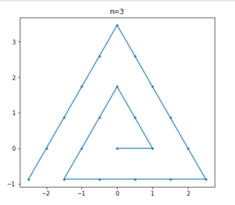
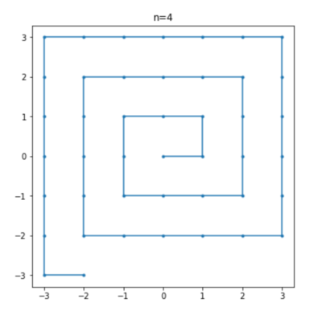
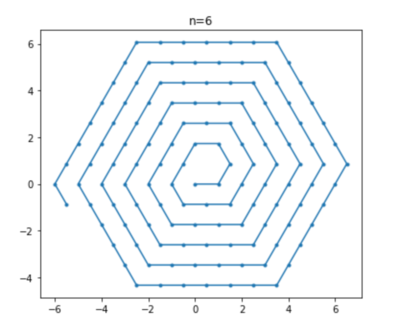

It isn't entirely clear why only these numbers produce regular spirals, but it seems that it is likely a consequence of the fact that it is only for these values of n that cos(2pi/n) is rational which can be shown as a corollary of Niven's theorem. It is also likely that under the circumstances the LEFT and FORWARD operations naturally form simple finite groups, but this does not occur if cos(2pi/n) is irrational. Exactly if or why this is so isn't yet understood by me.

Aside from the 3 regular these cases the path traced by the algorithm is anything but predictable although odd and even values of n tend to produce
different kinds of plots. For example, plots for even n usually look something like these:

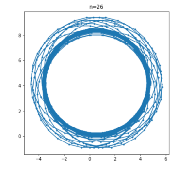
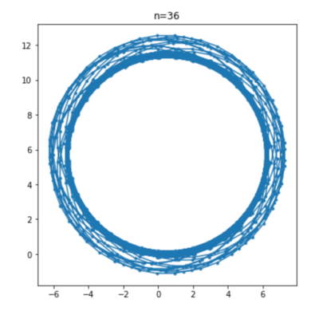
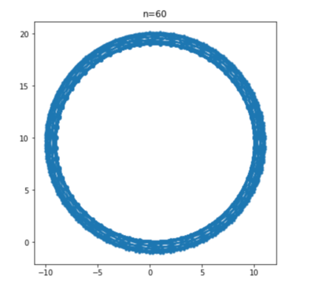

Whereas, plots of odd n tend to produce wider bands that look like the 2D-projection of a 3D-torus.

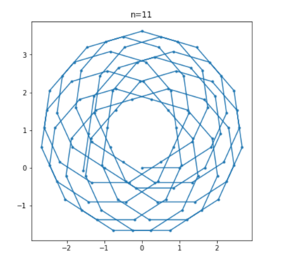
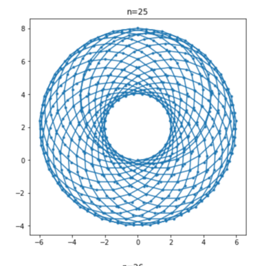
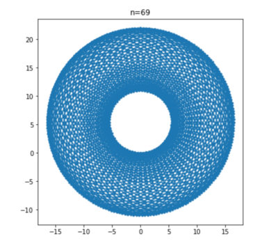

Most interesting of all is n=12 which one might intuitively think would, because it is itself a number that is full of symmetry, produce a very symmetrical solution. In fact, it actually appears to produce the most chaotic "chaotic spirals" of them all, which is an intriguing mystery!

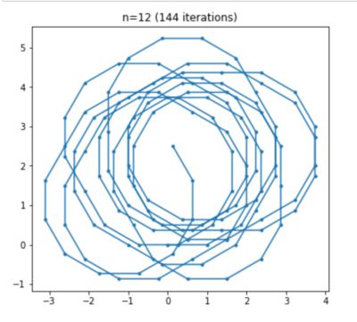
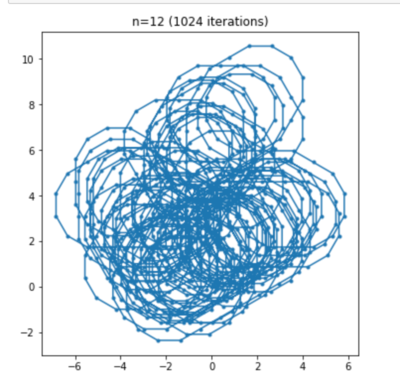

Is this true chaos?

If chaos is defined by the presence of sensitive dependence on initial conditions, this system does seem chaotic. A gallery of images which shows what happens to the n=12 case when the initial conditions are varied sligtly can be viewed in this [FaceBook post](https://www.facebook.com/jon.seymour.au/posts/10165187512170481).

# Algorithm

The generation algorithm itself is very simple. The algorithm mutates a complex state vector once per loop by multiplying the state vector by an operation matrix - either LEFT or FORWARD. LEFT adds the current direction to the current position, then rotates the current direction left. FORWARD adds the current direction to the current position, and leaves the current direction unchanged. Both operations also keep track of the previous direction by updating the previous direction vector with the current direction vector before updating the current direction vector with a new value, if any.

The algorithm will turn LEFT by default, but if doing this will cause the next operation to intersect with a previously visited point, it moves FORWARD instead. For n=3,4 and 6 this produces a well-behaved, regular spiral but for all other values of n it appears to produce a so-called "chaotic spiral". 

The initial versions of the algorithm used the MatrixState class which did involve a lot of floating point arithmetic, particularly in the paths that fed into the decision about whether to turn left or go forward. It was, at least principle, possible that the chaotic behaviour arose from the use of floating point arithmetic to decide whether to turn left or go forward.

However, the current versions of the algorithm use the VectorState class instead and are purely vector based and the decision to go forward rather than left is precisely determined by comparison of integer vectors, rather than dependent on the vagaries of the floating point representation. With this being true, we can say that the chaotic behaviour is inherent in the system itself and not due to the vagaries of the floating point representations.

It is also true that the chaos only arises because each action leaves a trace in the world (in the form of an element in the visited set) and this trace then influences future action and if it wasn't for this memory, the behaviour would not be chaotic.

Chaos arises, therefore, as the interplay between a system of equations and the state of the world.

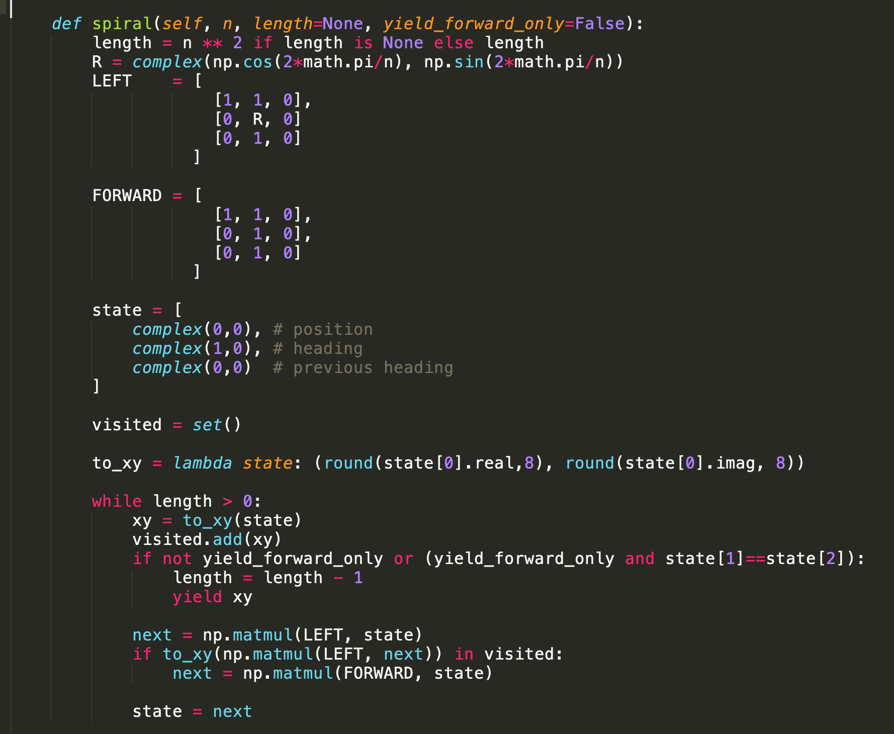

# Installation

The easiest way to install and run the sample Jupyter notebook is to install make and docker on your local machine and run:

    make docker-run

Then visit 8888 of your docker machine with a web browser. If you need the token to login to the Jupyter notebook, then run:

    make docker-token

Select the start-here notebook, and select run.

If you already have Python 3 installed locally, you might prefer to run jupyter locally. In which case:

    make local-build && make local-run

Your browser should open directly, then select the start-here notebook as above.

# Other Resources

[@nick_treweek](https://twitter.com/nick_treweek) has implemented this algorithm as an interactive JavaScript [page](http://secondworldstudios.com.au/spiral/). Nick's solution also makes an attempt at detecting intersections with previous steps (rather than just previous points) although because he only uses a 1-step look ahead, this eventually results in chaos too after n=14. Nick is also responsible for bringing to my attention the relationship r = 2n/(n-2) which relates the number of sides of a polygon to the number of rotations about a vertex required to achieve identity. This equation only has integer solutions for n in {3,4,6}. I generalise this insight in some more detail [here](https://github.com/wildducktheories/curious-factors) including identifying a correspondence between integer solutions of r=2n/(n-r) and complex solutions for r'=a'n'/(n-a') where a' = i, n' = e^(2pi/n.i)+i, r' = e^(2pi/r.i)+i
