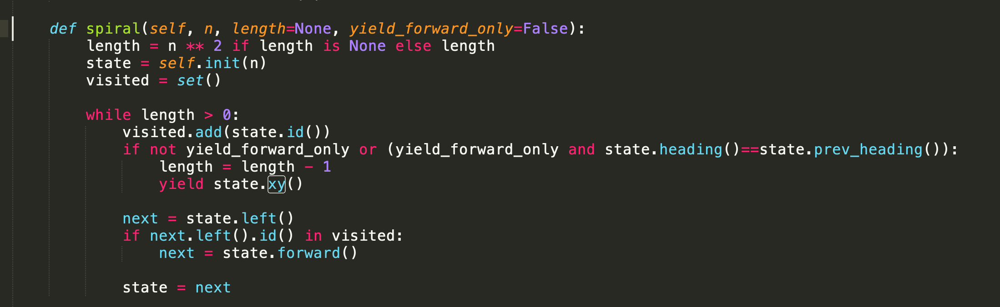

# Chaotic Spirals

This repository contains a simple algorithm for drawing "chaotic" spirals. 

In actual fact, it also produces nice regular polygonal spirals that one might expect from such an algorithm, but it only does this for n=3,4 or 6.

It isn't entirely clear why only these numbers produce regular spirals, but it seems that it is likely a consequence of the fact that it is only for these values of n that cos(2pi/n) is rational which can be shown as a corollary of Niven's theorem. It is also likely that under the circumstances the LEFT and FORWARD operations naturally form simple finite groups, but this does not occur if cos(2pi/n) is irrational. Exactly if or why this is so isn't yet understood by me.

Aside from the 3 regular these cases the path traced by the algorithm is anything but predictable although odd and even values of n tend to produce
different kinds of plots. For example, plots for even n usually look something like these:

Whereas, plots of odd n tend to produce wider bands that look like the 2D-projection of a 3D-torus.

Most interesting of all is n=12 which one might intuitively think would, because it is itself a number that is full of symmetry, produce a very symmetrical solution. In fact, it actually appears to produce the most chaotic "chaotic spirals" of them all, which is an intriguing mystery!

Is this true chaos? It is hard to say. Chaos is conventionally defined as sensitivity to initial conditions. It is possible that the behaviour observed here is simply due to the rounding operation that is required at one key point in each iteration of the generation loop. The question that still remains, however, is why the behaviour of n=12 seems to be so different to every other value of n.

# Algorithm

The generation algorithm itself is very simple. The algorithm mutates a complex state vector once per loop by multiplying the state vector by an operation matrix - either LEFT or FORWARD. LEFT adds the current direction to the current position, then rotates the current direction left. FORWARD adds the current direction to the current position, and leaves the current direction unchanged. Both operations also keep track of the previous direction by updating the previous direction vector with the current direction vector before updating the current direction vector with a new value, if any.

The algorithm will turn LEFT by default, but if doing this will cause the next operation to intersect with a previously visited point, it moves FORWARD instead. For n=3,4 and 6 this produces a well-behaved, regular spiral but for all other values of n it appears to produce a so-called "chaotic spiral". 

The rounding operation used to detect intersection somewhat arbitrarily chooses to round to 8 decimal places of precision. It seems unlikely that this directly contributes to the emergence of chaotic behaviour, but I haven't conclusively proved that it doesn't either.

# Installation

The easiest way to install and run the sample Jupyter notebook is to install make and docker on your local machine and run:

    make docker-run

Then visit 8888 of your docker machine with a web browser. If you need the token to login to the Jupyter notebook, then run:

    make docker-token

Select the coding-challenge notebook, and select run.

If you already have Python 3 installed locally, you might prefer to run jupyter locally. In which case:

    make local-build && make local-run

Your browser should open directly, then select the coding-challenge notebook as above.

